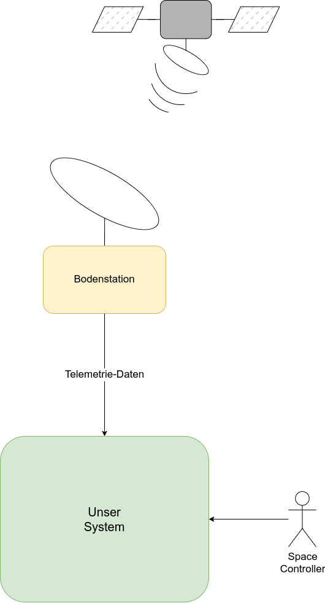
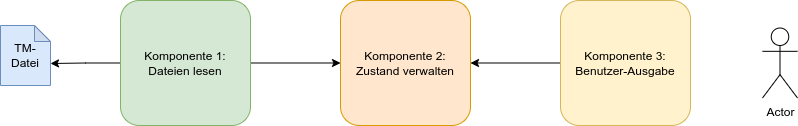

# Aufgabe

## Telemetrie-Daten für einen Satelliten auswerten und darstellen.

Ein Satellit sendet in unregelmäßigen Abständen Telemetrie-Daten, aus denen der aktuelle Zustand der verschiedenen Sensoren abgeleitet
werden soll. Dies können z.B. Temperatur und Druck einer Steuerdüse sein.

Haupt-Aufgabe des Systems ist es, diese Daten entgegenzunehmen, den Zustand der geänderten Parameter zu aktualisieren und einem
Benutzer alle aktuellen Werte anzuzeigen.



Die Telemetrie-Daten kommen in unserem System als Dateien an. Sie enthalten Messdaten von jeweils einem Sensor. Die Sensoren senden Daten in unterschiedlichen Frequenzen. Je nach Sensor können unterschiedliche Parameter gemessen werden. (Zunächst betrachten wir nur einen Sensor-Typ)

Die Dateien werden in ein bestimmtes Verzeichnis gespeichert, die Daten darin liegen im JSON-Format vor. Das System soll diese Dateien jeweils genau einmal lesen, die darin enthaltenen Daten auslesen und den Zustand der zugehörigen Parameter anpassen. Einem/einer Space Controller soll der aktuelle Zustand aller Parameter angezeigt werden.

## Struktur/Architektur

Wir schlagen vor, das System in drei Komponenten zu unterteilen.

* Die erste Komponente öffnet die Dateien, liest die enthaltenen Daten ein und  gibt sie an die zweite Komponente weiter. Außerdem sorgt sie dafür, dass bearbeitete Dateien nicht mehr bearbeitet werden.

* Die zweite Komponente verarbeitet Daten, die von der ersten Komponente geliefert werden. Sie kennt den aktuellen Zustand aller Parameter, passt die Werte bei Bedarf an und kann den Zustand auf Anfrage an die dritte Komponente ausgeben.

* Die dritte und letzte Komponente ist für die Ausgabe der Daten an eine\*n Benutzer\*in zuständig.



## Aufgaben

### Alle

* Besprecht die Schnittstellen zwischen den Komponenten!

  * Welchen Zweck hat jede Schnittstelle?

  * Welche Daten müssen ausgetauscht werden, um diesen Zweck zu erfüllen?

  * Wer ruft wen auf?

* Vervollständigt das obige Bild.

* Findet bessere Namen für die Komponenten :D

### Komponente 1

* Die Dateien kommen in unvorhersagbaren Abständen an. Überlegt euch, wie ihr neue Dateien erkennt und verarbeitet.

* Jede Datei soll nur einmal verarbeitet werden. Wie stellt ihr das sicher?

* Öffnet die Dateien und lest die enthaltenen Daten. Wandelt das Format ggf. so um, dass es zur vereinbarten Schnittstelle von Komponente 2 passt.

* Stellt die Daten für Komponente 2 bereit.

* Zusatzaufgaben:

  * Datenvalidierung
  * bei größeren Dateien kann es vorkommen, dass eine Datei noch nicht vollständig geschrieben ist, wenn wir sie “sehen”. Wie verhindert ihr, dass unfertige Dateien verarbeitet werden?

### Komponente 2

* Empfangt die Daten von Komponente 1.

* Identifiziert die Quelle (also den zugehörigen Sensor) und ändert den aktuellen Zustand dieses Sensors. Überlegt euch, wie ihr mit unbekannten Sensoren umgeht. Also mit Sensoren, die aktuell noch keinen Zustand im System haben.

* Gebt die Daten des aktuellen Zustands an Komponente 3 weiter.

* Zusatzaufgaben:

    * Speichert die Informationen, die von Komponente 1 kommen, damit man den Verlauf später nachvollziehen kann

    * Speichert den aktuellen Zustand und ladet den letzten Zustand beim Programmstart aus diesem Speicher

### Komponente 3

* Überlegt euch, welche Daten ein*e Space Controller vermutlich sehen möchte und wie ihr sie darstellen/ausgeben wollt.

* Ruft die Daten von Komponente 2 ab.

* Gebt die Daten aus. Die Anzeige soll auf Änderungen des Zustands reagieren und die neuen Werte ausgeben.

* Zusatzaufgaben:

    * Für manche Werte gibt es kritische Bereiche. Wenn ein Wert so einen Bereich erreicht, soll eine Warnung ausgegeben werden

    * Warnungen sollen zusätzlich als E-Mail versendet werden

## Daten

Beispiel:

```
{
	type: "thruster",
	name:"starboard thruster 3.d",
	pressure: 3.345,
	temperature: 432.21
}
```


