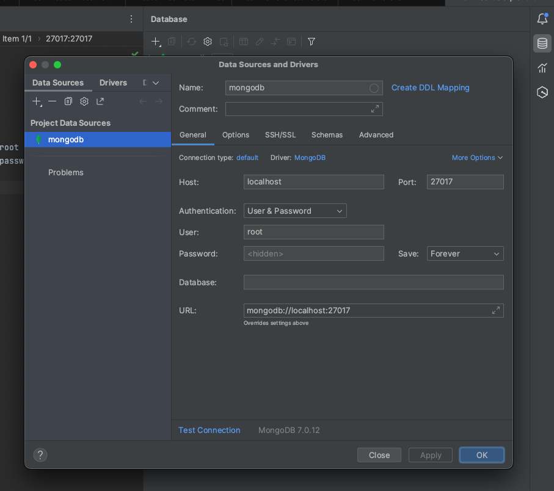

# QAware Schülerpraktikum 2024

Repository to store code, which is used at the Schülerpraktikum 2024 at QAware.

## Installation

0.) Optionally create a virtual environment for your python packages of this project:

```
python3 -m venv venv
source venv/bin/activate
```

If you created a virtual environment, set it as python interpreter in your IDE.
In Intellij: Click on File -> Project Structure.
Add a new Python SDK of type Virtualenv environment -> existing environment.
Set the interpreter to the python that is located in the directory of your newly created virtual environment.

1.) Install all dependencies:

```
pip install -r requirements.txt
```

2.) Start the database:

```
docker compose up -d
```

3.) Start the uvicorn backend:

```
uvicorn BeispielVerwaltung:app --reload
```

The reload command is used to be able to update the code and start the application automatically.

4.) Optional: Add the database to your IDE



For IntelliJ, you can do that in the database menu on the right of the window. Add a new data source via the '+' icon. Select MongoDB as type and give your database a name. Enter the credentials from the [docker-compose.yml](./docker-compose.yml) file and test the connection. If necessary, download the missing driver files.

## Usage

After the installation the API can be called via curl or the browser to serve the user with data or as data storage.

For example: \
http://127.0.0.1:8000/hello_world 

A more generalized overview of existing APIs can be retrieved in a Swagger UI under:
http://127.0.0.1:8000/docs

## Helpful Links

- [AsyncIOMotorClient – Connection to MongoDB](https://motor.readthedocs.io/en/stable/api-asyncio/asyncio_motor_client.html)
- [FastAPI Documentation](https://fastapi.tiangolo.com/)
- [Git Documentation](https://git-scm.com/docs)

## Maintainer

R. Kalleicher, <robin.kalleicher@qaware.de>
T. Schneider, <thea.schneider@qaware.de>     
N. Feifel, <nina.feifel@qaware.de>

## Initial Code and Idea

R. Kalleicher, <robin.kalleicher@qaware.de>     
C. Thelen, <christoph.thelen@qaware.de>